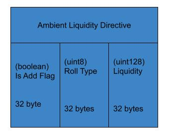
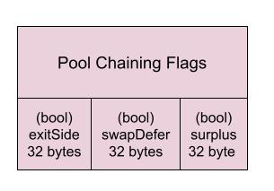

# Encoding Long Form Orders

To optimize gas, long-form CrocSwap calls rely on Solidity ABI encoding for primitive types but encode at fixed positions instead of using Solidity ABI array encoding. Clients calling these functions must directly encode a byte string
based on specification described here. CrocSwap will also make available a TypeScript based SDK to support client-side encoding.

The input argument for long-form orders is a binary encoding, with several nested variable length array fields. Each array field is preceded by a count field that
must allign with the number of elements in the array. The nested structure is visualized below. 

(*In the below and following diagrams all primitive type fields are marked with their Solidity type and byte size.*)

Visualized in the above diagram are the following nested layers. 

The base layer order directive is composed of the following sub-fields:
* Settlement directive (opening): The user directive for settling collateral related to flows in the first token of the first pair.
* Hop directives array: An array of directives, constituting a chain of hops, each corresponding to a sequence of overlapping pairs.

Each hop directive (second layer) is composed of the following sub-fields:
* Pool directives array: An array of one or more directives, each corresponding to a set of tradable actions to take place on a single liquidity pool type within the pair.
* Settlement directive: The user directive for settling related to flows in the second token of the pair. Along with the previous settlement directive (either the previous hop in the chain or the top-layer opening settlement directive), this defines the token pair over which this hop takes place on.
* Price improve flags: Flags indicating if the user is requesting off-grid price improvement and on which side.

Pool directives (third layer) are arranged as a compose of the following:
* Pool type index: Index of the pool type that the trading actions should be applied to. This index is set by the protocol and corresponds to market parameters such as fee rate, grid size, etc.
* Ambient liquidity directive: A directive defining any net mint or burn actions (if any) to take on ambient liquidity in the pool 
* Range liquidity directives: An array (possibly empty) of directives related to minting or burning concentrated liquidity range orders
* Swap directive: A directive specifying the net swap action (if any) to take on the pool
* Chaining flags: A set of flags related to how the pool chains rolling flow between pairs. 

The remaining sections decompose the composite fields not broken down by the original visualization.

## Settlement Directive

Describes the settlement directive from both the opening of the top-layer order directive as well as at each hop in the chain.
* Token: The address of the token for this leg of the chain. (Or `0x0` for pairs with native Ethereum legs)
* Limit Qty: The user's minimal-acceptable quantity for net flows on this leg. Worse than this threshold will revert the entire transaction
* Dust threshold: The quantity threshold below which the user requests to skip the token transfer (usually to save gas on economically meaningless flows)
* Surplus collateral flag: If true, the user requests to first settle any flows using their surplus collateral balance at the exchange.

## Ambient Liquidity Directive

* Is Add: If true indicates that this action is to mint liquidity. If false, burns liquidity.
* Roll Type: A numeric code indicating how to apply (if any) an offset based on a previously accumulated rolling quantity in the long form order.
* Liquidity: The total amount of liquidity to mint or burn. (Or zero if no action)

### Swap Directive

* Flags: Bit flag field with two flags:
    * Is Buy: Indicates swap will convert base-side token to quote-side token. (By convention CrocSwap internally always defines the base side as the token with the lexically smaller address in the pair.)
    * In Base Qty: The quantity field of the swa is denominated in the pair's base-side token.
* Roll Type: A numeric code indicating how to apply (if any) an offset based on a previously accumulated rolling quantity in the long form order.
* Qty: The quantity to swap (final result could be smaller if swap hits the limit price).
* Limit Price: The worse price up to which the user is willing to trade. Note that this represents the price on the margin, for this reason the average fill price of the swap will always be better than this limit price.

### Range Bookend Directive

Describes the range directive that defines a single concentrated liquidity range order.
* Low tick: The price tick index on the lower side of the range order
* High tick: The price tick index on the high side of the range order.
* Relative tick flag: If set to true the low/high tick are defined as a relative offset to the current price tick
* Is Add: If true indicates that the order is minting liquidity. If false, burning.
* Roll Type: A numeric code indicating how to apply (if any) an offset based on a previously accumulated rolling quantity in the long form order.
* Liquidity: The amount of liquidity to mint/burn.

### Price Improve Flags

* Is Enabled: If true the user is requesting off-grid price improvement. (Normally disabled unless used to save on gas.)
* Use base side: If enabled the user is requesting that price improve collateral threshold is based on the base-side token in the pair. (Be aware by convention CrocSwap internally always defines the base side as the token with the lexically smaller address in the pair.)

### Chaining Flags

* Exit side: If true, indicates whether any gap back fills should use the second token in the pair
* Swap Defer: If true, the swap directive is executed *after* the liquidity directives. Default is to execute before.
* Offset surplus: If true, any gap backfills should be offset by the client's pre-existing surplus collateral held at the exchange.

### Field Encoding
The long-form order directive contains four distinct types of fields:
* Composite fields: Composed of multiple sub-fields in a pre-determined arrangement. Composite fields can be nested.
* Arrays: Contain 0, 1 or more (up to 256) elements of the same type. 
* Primitives: A single address or value representing a specific Solidity type that can be encoded in 32 bytes or less
* Flags: One or more boolean flags that are packed bitwise into a single byte.

All array fields conform to the following structure:

Starts with a length premable: a single `uint8` byte that encodes the length of the array. If the length is zero, that's the entire field. Otherwise 
there is N sequential elements of the sub-type of the array. 

Valid primitive types are the following, along with the number of bytes they're encoded over. All primitives are encoded as 32 bytes compatible with Solidity ABI formatting. 

* `bool`: 32 bytes
* `uint8`: 32 bytes
* `uint3`: 32 bytes
* `int3`: 32 bytes
* `address`: 32 bytes
* `int128`: 32 bytes
* `uint128`: 32 bytes
* `uint256`: 32 bytes
* `int256`: 32 bytes

Flags are always encoded big-endian and padded with zeros for any unused bits in the field.
